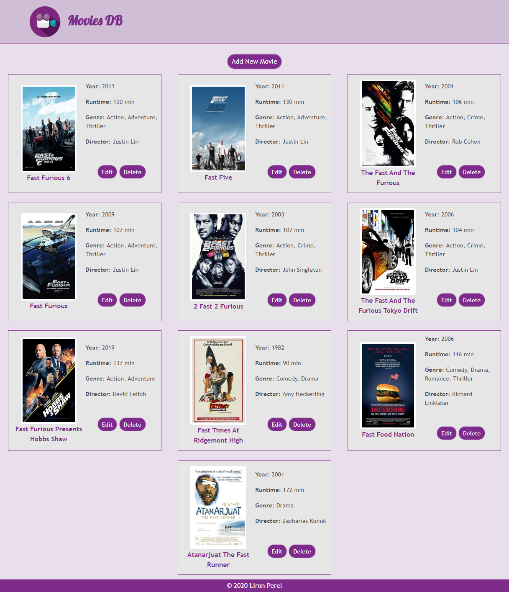
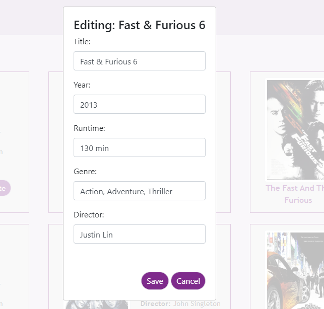
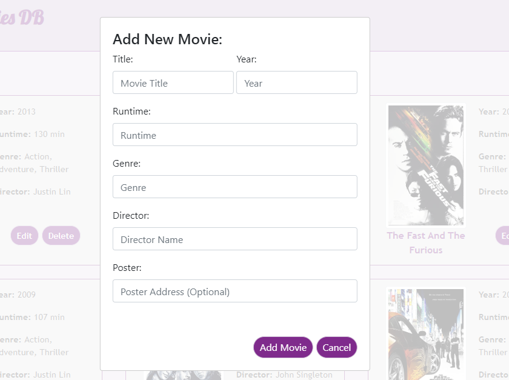

# Movies-DB
> Client side single page application developed with React.js

[Working Demo](https://lironperel.github.io/Movies-Db-React/)

## Main Features
* Main page showing random movies details
  * Movie cover and title
  * Year
  * Runtime
  * Genre
  * Director
* Movies data taken from OMDB API - [http://www.omdbapi.com/](http://www.omdbapi.com/)
* Each movie can be deleted or edited
* User can add new movies using 'Add New Movie' button
* Responsive UI + Mobile support

## Development setup

1. Clone
2. Run `npm install` on main folder
3. Run `npm start`

## Meta

Liron Perel – lironp90@gmail.com

Distributed under the MIT license.

[https://lironperel.github.io/Movies-Db-React/](https://lironperel.github.io/Movies-Db-React/)
